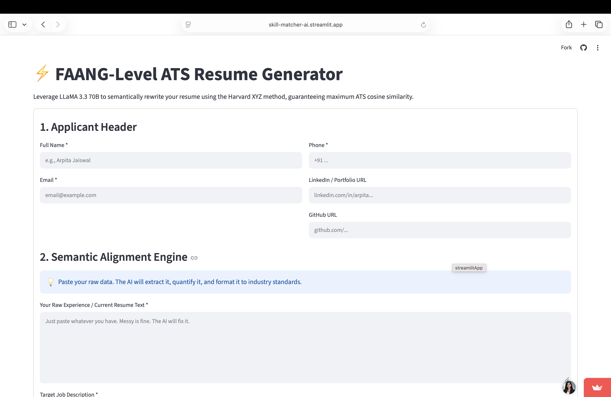

# 🚀 SkillMatch AI

<p align="center">
  
  
  
  
  
</p>

> **AI-Powered ATS Resume Generator for Job-Specific Resume Optimization**

Generate professional, ATS-friendly resumes tailored to a target job description using Large Language Models. The application rewrites resume content, enhances professional language, and exports a polished PDF ready for submission.

🌐 **Live Demo:** https://skill-matcher-ai.streamlit.app/

---

# 📖 Overview

Recruiters and Applicant Tracking Systems (ATS) often filter resumes before they reach hiring managers. Many candidates miss interview opportunities because their resumes are not tailored to the requirements of a specific job.

**SkillMatch AI** streamlines this process by leveraging Generative AI to transform raw resume information into a professionally structured, ATS-friendly resume that aligns with a target job description.

Built using **Python**, **Streamlit**, **Groq**, **Llama 3.3 70B**, and **FPDF2**, the application demonstrates how Large Language Models can automate resume enhancement while preserving readability and professional formatting.

---

# 🎯 Features

## 📄 ATS Resume Generation

Generate a clean, ATS-friendly resume tailored to a specific job description.

---

## 🤖 AI Resume Rewriting

The application automatically:

* Rewrites experience descriptions
* Improves professional wording
* Highlights relevant technical skills
* Aligns resume content with the target role
* Produces concise, recruiter-friendly bullet points

---

## 💼 Job Description Optimization

Paste any job description and the AI adapts the resume content to better reflect the required:

* Skills
* Technologies
* Responsibilities
* Keywords
* Professional terminology

---

## 📑 Professional PDF Export

Generate and download a professionally formatted resume in PDF format with a single click.

The exported resume is:

* ATS-friendly
* Cleanly formatted
* Ready for job applications
* Optimized for readability

---

# 🏗 Workflow

```text
Applicant Information
        │
        ▼
Resume Details
        │
        ▼
Target Job Description
        │
        ▼
Llama 3.3 Resume Optimization
        │
        ▼
ATS-Friendly Resume Formatting
        │
        ▼
PDF Generation
        │
        ▼
Download Optimized Resume
```

---

# 📸 Application Preview

### Resume Builder Dashboard



---

# ⚙️ Technology Stack

| Layer                | Technology                |
| -------------------- | ------------------------- |
| Programming Language | Python                    |
| Frontend             | Streamlit                 |
| LLM                  | Llama 3.3 70B             |
| Inference Provider   | Groq                      |
| PDF Generation       | FPDF2                     |
| Deployment           | Streamlit Community Cloud |

---

# 🚀 Getting Started

### Clone the Repository

```bash
git clone https://github.com/imarpitajaiswal/Skill-Matcher-AI.git
cd Skill-Matcher-AI
```

### Create a Virtual Environment

```bash
python -m venv .venv
source .venv/bin/activate
```

### Install Dependencies

```bash
pip install -r requirements.txt
```

### Configure Environment Variables

Create a `.env` file:

```env
GROQ_API_KEY=your_groq_api_key
```

### Run the Application

```bash
streamlit run app.py
```

---

# 💡 Use Cases

* Resume customization for specific job applications
* ATS-friendly resume generation
* Professional resume rewriting
* Career preparation
* Internship and placement applications
* Software engineering job applications

---

# ✨ Highlights

* AI-powered resume rewriting
* Job-specific resume customization
* ATS-friendly formatting
* Professional PDF generation
* Groq-powered LLM inference
* Interactive Streamlit interface
* One-click resume download

---

# 🔮 Future Enhancements

* Cover letter generation
* Multiple resume templates
* LinkedIn profile optimization
* Resume version management
* Interview preparation suggestions
* Multi-language resume generation

---

# 👩‍💻 Author

## Arpita Jaiswal

**AI Engineer | Generative AI | Agentic AI Systems | Enterprise AI Architecture**

Building AI applications using Large Language Models, Agentic AI, and modern software engineering to solve real-world productivity challenges.

### Connect

* 🌐 Portfolio: https://arpita-portfolio-puce.vercel.app
* 💻 GitHub: https://github.com/imarpitajaiswal
* 💼 LinkedIn: https://linkedin.com/in/imarpitajaiswal
* ✍️ Medium: https://medium.com/@imarpitajaiswal
* 𝕏 X: https://x.com/imarpitajaiswal
